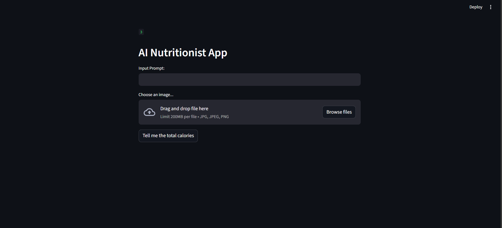
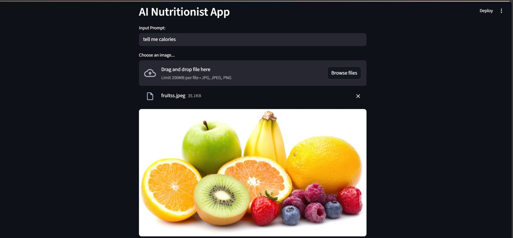
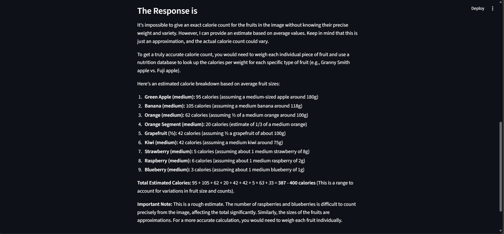

# 🥗 Nutritionist AI – Your Comprehensive Guide to Healthy Eating and Well-being

**Nutritionist AI** is an intelligent mobile and web-based nutrition app powered by the **Gemini Pro** model. It offers **personalized dietary recommendations**, **AI-driven meal plans**, and **real-time nutrition analysis** based on individual goals and health profiles. Whether you're aiming to lose weight, manage a condition like diabetes, or build muscle, Nutritionist AI provides **smart, tailored advice** to help you thrive.

---

## 🚀 Key Features

- 🤖 **Powered by Gemini Pro**: Uses Google’s Gemini AI to provide intelligent, context-aware recommendations
- 🧬 **Personalized Nutrition**: Meal plans based on health conditions, goals, and dietary preferences
- 📷 **Photo & Barcode Logging**: Analyze meals using image input or barcode scanning
- 📊 **Nutritional Feedback**: Get real-time feedback on calorie intake, macronutrient balance, and more
- 🔗 **Fitness Tracker Sync**: Integrates with activity data to refine calorie and nutrition suggestions
- 📚 **Educational Tips**: Access resources to learn about healthy eating, disease prevention, and diet science

---

## 🖼️ Screenshots

### 🏠 Home Dashboard


### 🥗 Personalized Meal Plan


### 📊 Nutrition Summary


---

## 🧪 User Scenarios

### Scenario 1: **Weight Loss Journey**
Sarah, a 28-year-old vegetarian, wants to lose 15 pounds. She receives:
- A calorie-controlled vegetarian meal plan
- Barcode/photo-based meal logging
- Integrated feedback using her fitness tracker

### Scenario 2: **Managing Diabetes**
John, 45, with Type 2 Diabetes, receives:
- Low-carb, high-fiber meal suggestions
- Glycemic index info and carb tracking
- Educational resources for diabetic diets

### Scenario 3: **Building Muscle**
Emily, 30, follows a strength training program and gets:
- High-protein, nutrient-rich meals
- Dynamic adjustments based on workout data
- Protein intake tracking aligned with caloric needs

---

## 🛠️ Installation & Setup

Install the dependencies:
```bash
pip install -r requirements.txt

## Make sure to also set your Google API key for the Gemini models:

```bash
export GOOGLE_API_KEY="your_api_key_here"
```

##🧪 Run Locally
To run the app:
```bash
streamlit run app.py
```

## 📂 Project Structure
```bash
AI_doctor/
├── app.py                 # Streamlit app logic
├── screenshots/           # Folder containing screenshots
│   ├── screenshot1.png
│   └── screenshot2.png
├── requirements.txt       # Python dependencies
└── README.md              # You're here!
```
##📄 License
MIT License. Feel free to use, fork, or contribute!

## 🙋‍♂️ Author
Rishabh Agrawal
